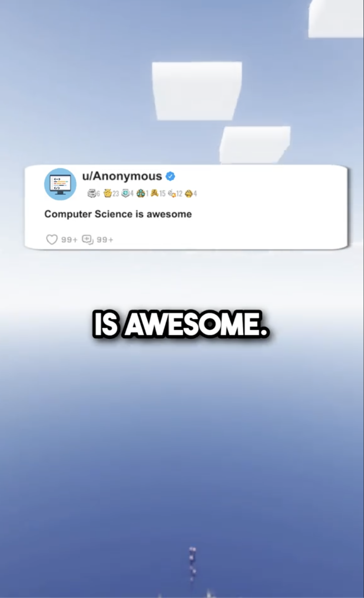

# 🖥️ CompSciReels

**`Digital Innovator (Developer/Creator)`**

I'm an indie software developer dedicated to spreading the joy of programming worldwide. I create projects and share all my code on GitHub. Each project inspires a new video that I post on my [TikTok](https://www.tiktok.com/@comp.sci.reels).

Check out my [Beacons](https://beacons.ai/comp.sci.reels). I offer resources on scholarships, college options, and programming projects.
<!-- Social badges section -->

  
  <a href="https://www.tiktok.com/@comp.sci.reels?lang=en">
     <!-- blank split -->
    </a>
     <a href="https://www.tiktok.com/@comp.sci.reels?lang=en">
    <!-- blank split -->
    </a> 
  <a href="https://github.com/CompSciReels?tab=stars">
       <!-- blank split -->
</a> 
      <!--https://custom-icon-badges.demolab.com/github/stars/CompSciReels--> 
      <!-- blank split -->
  

---
 &nbsp;Languages and Tools

<!---->

<!---->

<!---->
<!---->

<!---->
 

#

### 📹 Favorite TikTok Videos

<!-- BEGIN TIKTOK-CARDS -->

<!--**How much does an app...**  **What skills would you...**  **I study computer...**  
**Computer Science is...**
 140.7K views  70.9K views  49.3K views  22K views-->
<!-- END YOUTUBE-CARDS -->
 
  
  
#

### 📊 Stats

<!--  -->
